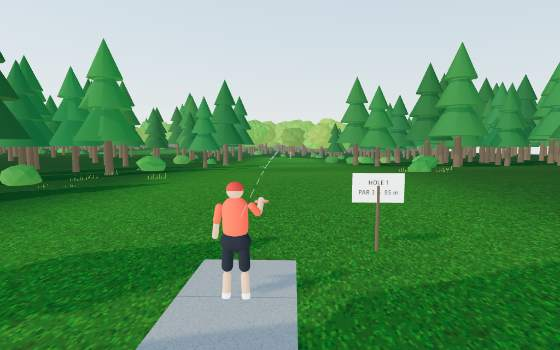

# Chains — mobile 3D disc golf

Swipe-to-throw disc golf in the browser. Aim by dragging the view, pick a disc and a throw type, then swipe in the throw pad: the swipe direction must match the throw (backhand →, forehand ←, tomahawk ↓, scoober ↖, putt ↑), the swipe length sets the power bar, and a slightly lower or higher swipe adds hyzer or anhyzer. Discs fly with a real turn/fade model, skip, roll, kick off trees, chain out, and splash into ponds.



## Play

- **Quick round** — you vs two bots (easy / medium / hard).
- **Pass & play** — up to six people on one phone, plus optional bots.
- **Online room** — one player creates a room and shares a 4-letter code; friends join from their own phones. Peer-to-peer over [PeerJS](https://peerjs.com/), no server to run.

Three courses, three or nine holes each:

- **Pine Hollow** — wooded, tight fairways, doglegs, water on 3, 6 and 9.
- **Cedar Meadows** — open rolling meadow at golden hour, long holes, strong wind.
- **Lakeshore Links** — morning light, water in play on five holes.

**Locker room** — name, skin, hair, headwear, jersey and trim colours, number, shorts, shoes, build, shades. Your avatar stands on the tee behind the main menu and shows up in every mode, including online rooms (each player's look travels with them).

Works on phones (touch) and desktop (mouse). Add it to your home screen for a full-screen app.

## Rules implemented

Standard stroke play, lightly simplified:

- Lowest total throws wins; scores shown relative to par (ace, eagle, birdie, par, bogey…).
- Tee order is by honors (best score on the previous hole). After the tee, the player farthest from the basket throws next.
- The next throw is played from where the disc came to rest (your lie).
- Holed when the disc comes to rest in the tray or is caught by the chains. Putts thrown too hard blow through or spit out ("chain out").
- Water and the course boundary are out of bounds: +1 penalty throw, play from where the disc last was in bounds.
- Circle 1 (10 m) is drawn around every basket. Pick-up at par + 5 keeps rounds moving.

## The flight model

`src/physics.js` is plain math with no rendering dependency, so the bots plan with it and it runs in a Node test.

- Lift and drag from angle of attack (a flattened, low-lift version of the classic Frisbee coefficients).
- Gyroscopic roll: above the disc's stable speed it **turns** (rolls toward anhyzer), below it **fades** (rolls toward hyzer). Spin direction flips for forehand, so backhands finish left and forehands finish right for a right-handed player.
- Discs have real flight numbers (speed | glide | turn | fade). Throw a putter at driver speed and it turns over; throw a driver too slowly and it dumps early.
- Ground skips, cut rollers, tree trunks (hard kicks) and foliage (random branch hits), and a basket with chains, band, tray and pole.
- Overhand throws start vertical and roll over in flight; the scoober starts inverted and flips back to flat.

## Run it locally

Any static server works. Without dependencies:

```bash
node serve.mjs
```

then open http://localhost:8093. (Opening `index.html` from disk won't work because ES modules need http.)

Physics sanity test:

```bash
node test/physics.test.mjs
```

## Deploy

It's static: push to GitHub and enable **Pages** on the repository root. Three.js and PeerJS load from CDNs.

## Structure

| File | What it does |
|---|---|
| `src/physics.js` | Flight model, collisions, basket catch, OB, headless simulation |
| `src/course.js` | Seeded terrain, fairways, instanced trees with colliders, ponds, tee pads, baskets, sky |
| `src/player.js` | Procedural rigged golfer with keyframed throw animations per throw type |
| `src/input.js` | Pointer gestures: aim drag and throw swipes |
| `src/bot.js` | Bots simulate candidate throws and pick the best, with difficulty noise |
| `src/net.js` | PeerJS host/guest rooms |
| `src/audio.js` | Synthesized sound: modal metallic chain cascades, wood knocks, water, wind and birds, with a short outdoor reverb |
| `src/assets.js` | Optional asset manifest: drop generated textures, course art, disc stamps and real recordings into `assets/` |
| `src/main.js` | Game state machine, camera, hub menu, locker room, HUD wiring, online sync |

No build step and no required assets: every texture, the avatar and every sound are generated in code. To upgrade the look and sound with generated or recorded assets, follow [docs/codex-asset-prompts.md](docs/codex-asset-prompts.md); anything you add to `assets/manifest.json` replaces the procedural version, everything else keeps working.
