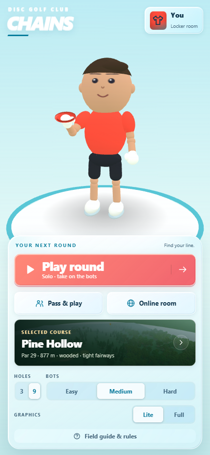

# Chains — mobile 3D disc golf

Swipe-to-throw disc golf in the browser. Aim by dragging the view, pick a disc and a throw type, then swipe in the throw pad: the swipe direction must match the throw (backhand →, forehand ←, tomahawk ↓, scoober ↖, hammer ↘, blade ↙, putt ↑; inside-out and outside-in variants of both backhand and forehand), the swipe length sets the power bar, and a slightly lower or higher swipe adds hyzer or anhyzer. Discs fly with a real turn/fade model, skip, roll, kick off trees, chain out, and splash into ponds.



## Play

- **Play round** — you vs two bots (easy / medium / hard).
- **Pass & play** — up to six people on one phone, plus optional bots.
- **Online room** — one player creates a room and shares a 4-letter code; friends join from their own phones. Peer-to-peer over [PeerJS](https://peerjs.com/), no server to run.

Four courses, three or nine holes each:

- **Pine Hollow** — wooded, tight fairways, doglegs, water on 3, 6 and 9.
- **Cedar Meadows** — open rolling meadow at golden hour, long holes, strong wind.
- **Lakeshore Links** — morning light, water in play on five holes.
- **Gull Point Bluffs** — exposed coastal headland: the windiest course by far. Windsocks on every tee, drifting wind streaks and leaning grass show what the flight model is fighting.

**Locker room** — a Blender-authored athlete (`tools/build-golfer-v2.py`) with Face / Hair / Outfit / Body tabs. Face: eyes, eye colour, brows, nose, mouth, facial hair and glasses are atlas decals on the head. Hair: twelve styles, seven kinds of headwear, colours for both. Outfit: shirt colour and style (hoops, stripes, sash, sleeves, split, chevron), trim, number, shorts, socks, shoes, wristbands. Body: skin, build, height and throwing hand (left-handers get mirrored clips and physics). Each player's appearance travels with them in online rooms.

Works on phones (touch) and desktop (mouse). Add it to your home screen for a full-screen app.

### Look

Stylised shapes, physically based surfaces. The ground is a photographic grass tile washed 58% toward white so it supplies blade grain while each course's palette lives in vertex colours (mow stripes, first-cut collar, putting green, worn soil); a blade-scale normal map repeats eight times finer than the tile, and dirt and sand blend in by splat weight. Trunks carry a bark photo, tee pads concrete, water a scrolling normal map. One warm sun casts filtered shadows from trees, players and baskets; the sky is prefiltered into image-based ambient so discs, chains and shoes reflect it. Bodies get a tiled fabric weave, a skin pore normal map and a Fresnel rim light. Full adds the course HDRI, bloom and a broadcast grade (lift, saturation, grain, corner vignette); Lite keeps every texture and shadow without render targets. ACES tone mapping on both.

### Game interface

The clubhouse, course picker, locker room and HUD share white/cyan frosted glass, coral actions, local SVG icons and tactile buttons. Course cards show the actual toon course. The live HUD uses a compact score strip and equipment pickers. Sound icons crossfade, flight controls disable during throws, and leaving a round uses an in-game confirmation. Online validation appears beside the room controls.

Styles live in `src/ui.css`, with no external fonts or UI framework. Keyboard focus and reduced-motion styles are included. See the [art-pass report and screenshots](docs/qa/r3/REPORT.md); all six viewport overlap audits pass after this update.

## Rules implemented

Standard stroke play, lightly simplified:

- Lowest total throws wins; scores shown relative to par (ace, eagle, birdie, par, bogey…).
- Tee order is by honors (best score on the previous hole). After the tee, the player farthest from the basket throws next.
- The next throw is played from where the disc came to rest (your lie).
- Holed when the disc comes to rest in the tray or is caught by the chains. Putts thrown too hard blow through or spit out ("chain out").
- Water and the course boundary are out of bounds: +1 penalty throw, play from where the disc last was in bounds.
- Circle 1 (10 m) is drawn around every basket. Pick-up at par + 5 keeps rounds moving.

## The flight model

`src/physics.js` is plain math with no rendering dependency, so the bots plan with it and it runs in a Node test.

- Lift and drag from angle of attack (a flattened, low-lift version of the classic Frisbee coefficients).
- Gyroscopic roll: above the disc's stable speed it **turns** (rolls toward anhyzer), below it **fades** (rolls toward hyzer). Spin direction flips for forehand, so backhands finish left and forehands finish right for a right-handed player.
- Discs have real flight numbers (speed | glide | turn | fade). Throw a putter at driver speed and it turns over; throw a driver too slowly and it dumps early.
- Ground skips, cut rollers, tree trunks (hard kicks) and foliage (random branch hits), and a basket with chains, band, tray and pole.
- Overhand throws start vertical and roll over in flight; the scoober starts inverted and flips back to flat.
- The hammer is released past vertical, flattens upside down at the apex and drops steeply.
- Wind is a real force (headwind lifts and turns the disc over, tailwind starves it, crosswind pushes). Landings depend on the surface: rough grass kills skips and rolls, and a tilted landing rocks like a dropped coin before it settles.

## Run it locally

Any static server works. Without dependencies:

```bash
node serve.mjs
```

then open http://localhost:8093. (Opening `index.html` from disk won't work because ES modules need http.)

Physics sanity test:

```bash
node test/physics.test.mjs
```

## Deploy

It's static: push to GitHub and enable **Pages** on the repository root. Three.js and PeerJS load from CDNs.

## Structure

| File | What it does |
|---|---|
| `src/physics.js` | Flight model, collisions, basket catch, OB, headless simulation |
| `src/course.js` | Seeded terrain, fairways, instanced trees with colliders, ponds, tee pads, baskets, sky |
| `src/player.js`, `src/gltf-player.js` | Rigged GLB golfer, wardrobe, scrubbed Blender clips and procedural fallback |
| `src/models.js` | Optional GLB cache, Draco and KTX2 loaders |
| `src/materials.js`, `src/effects.js` | Toon terrain, foliage wind, clean water; retained optional legacy rendering infrastructure |
| `src/input.js` | Pointer gestures: aim drag and throw swipes |
| `src/bot.js` | Bots simulate candidate throws and pick the best, with difficulty noise |
| `src/net.js` | PeerJS host/guest rooms |
| `src/audio.js` | Synthesized sound: modal metallic chain cascades, wood knocks, water, wind and birds, with a short outdoor reverb |
| `src/assets.js` | Optional asset manifest: drop generated textures, course art, disc stamps and real recordings into `assets/` |
| `src/main.js` | Game state machine, camera, hub menu, locker room, HUD wiring, online sync |

No build step and no required assets. The shipped art replaces procedural defaults; an empty `assets/` folder still boots and plays. Sounds retain synthesis and accept optional sample overrides. To upgrade the look and sound with generated or recorded assets, follow [docs/codex-asset-prompts.md](docs/codex-asset-prompts.md); anything you add to `assets/manifest.json` replaces the procedural version, everything else keeps working.


## Graphics and animation

- **Lite:** procedural round-headed golfer, analytic face atlas, instanced foliage, toon ramp, gradient sky, cartoon clouds and blob shadows. Models and Full-only texture/decoder requests are skipped at startup.
- **Full:** the same bright art direction with the authored Blender body, ten separate mesh-free animation files, KTX2 face atlas and smaller waiting-player LOD. PBR grass, HDRI, SSAO and bloom are retired from the default look; their source infrastructure remains available.
- Five Blender throws use phase **0–0.5 for swipe windup**, **0.62 for release**, and **0.5–1 for follow-through**. Idle weight shifts, practice swings, fairway looks and score reactions use separate clips.
- A basket-to-tee camera introduces each hole. Chain-hit slow motion changes playback speed only; physics and network trajectory data stay unchanged.
- Graphics switching rebuilds and disposes course resources. Foliage uses spatial groups; resolution can scale down during sustained slow frames. Lite never exceeds its original pixel-ratio cap.

## Validation and budgets

Run the checks:

```bash
node test/physics.test.mjs
node test/assets.test.mjs
node test/animation.test.mjs
node test/feedback.test.mjs
python test/sfx-normalization.py
```

The asset test checks manifest files, GLB structure, Draco/KTX2 extensions, the golfer triangle budget, bone/material names and animation clips.

Round-three QA: **83 manifest entries**, all ten throws pass handedness and flight regressions, a real pointer swipe and a complete Full-quality hole pass, and empty-assets play works in both qualities. No JavaScript errors in integration checks. The six viewport overlap audit, including the open ten-entry throw sheet, includes 360×740, 430×932, 812×375, 568×320, 768×1024 and 1366×768. The previous PeerJS transport verification remains applicable: protocol source and message shapes were preserved.

The art pass brings Lite startup below **2 MB**, including CDN code (see the current byte ledger in [the canopy report](docs/qa/r4/REPORT.md)). Disc stamps are 6.6–18.7 KB; normal maps are 256px JPEGs. **60 fps Lite / 45 fps Full on mid-range Android and iPhone 12 remain physical-device targets, not certified results.** Desktop Chromium does not establish mobile GPU or Safari performance.

See [current canopy QA](docs/qa/r4/REPORT.md), [overlap and startup results](docs/qa/r4/after-browser-results.json), [round-three QA](docs/qa/r3/REPORT.md), and [decisions](docs/decisions.md). Round four closes the critic's cohesive-canopy defect in portrait and flyover views; its remaining named gap is ground lighting, outside that round. Lite transfers **731 KB**, within the same 2 MB startup budget. Before/after images live in `docs/qa/r4/`; 43.97 MB of historical captures were pruned previously and remain in Git history.

### Physical phone readings

Open the game with `?fps=1`, play **Pine Hollow hole one**, and read the overlay in each quality. These four results are pending user readings from the physical phones; desktop screenshots do not populate this table.

| Device | Lite FPS | Full FPS |
|---|---:|---:|
| Android | Pending | Pending |
| iPhone | Pending | Pending |

The [device record](docs/qa/r3/sound-device-detection.json) retains nulls until readings arrive. A result below **55 FPS Lite** or **40 FPS Full** triggers optimization of that phone's resolution scaling and foliage budget. The existing 60/45 FPS targets remain aspirational until measured.

## Rebuild art (optional authoring tools)

The web game needs none of these tools. Blender sources live in `art/blender/`; image prompts are in [the asset brief](docs/codex-asset-prompts.md).

```bash
blender --background --python tools/build-golfer-v2.py   # athlete body + phone LOD
blender --background --python tools/build-disc.py        # lathed disc with mould text
python tools/split-golfer-clips.py
# Rebuild the current authored motion set after rebuilding the body:
node tools/extract-poses.mjs
blender --background --python tools/author-golfer-clips.py
blender --background --python tools/author-canopies.py
python tools/texture-pack.py
node tools/build-face-atlas.mjs
```

The golfer body is **466,036 bytes / 10,800 triangles**; the distant LOD is **160,840 bytes / 3,230 triangles**. Thirty independent animation GLBs contain no mesh, material or texture payload: ten throws and five shared actions for each hand. Left-handed clips use positive scales, so jersey numbers stay readable. The eleven bone names remain unchanged. `tools/build-face-atlas.mjs` builds deterministic flat face parts and compresses them with Khronos `toktx`; the runtime retains its generated atlas fallback. Legacy model and Unity authoring tools remain in the repository.

Twelve original 256px painted JPEG detail tiles add 147.6 KB across all materials. The toon ramp and palette remain; skin and fabric follow the actor, while terrain blends fairway, rough, green and sand. See [texture provenance](art/textures/r3/prompts.json) and [motion authoring](docs/qa/r3/animation-authoring.md).

Six compact Blender crown variants use baked vertex occlusion and authored smooth normals: 528 triangles per pine and 576 per deciduous tree. The 49.3 KB embedded geometry retains instancing, wind deformation, 64 m groups and existing collision radii, and works with an empty asset manifest. Dense source meshes and the optimized shells are preserved in `art/blender/canopies-r4.blend`.

### Sound recordings — conditional generation skipped

`python tools/generate-sfx.py` uses the ElevenLabs sound-effects API to generate twelve effects, normalizes each to −6 dBFS, and publishes `manifest.sfx` only after the full set succeeds. It requires `ELEVENLABS_API_KEY` and ffmpeg. The credential was unavailable during this pass, so **no ElevenLabs recordings have been generated and `sfx` is still empty**. Synthesis supplies chains, applause, a descending miss reaction and reward notes until recordings are available. The normalization test uses a synthetic fixture, not a claimed generated recording.

`art/unity/Assets/Editor/RenderChains.cs` renders the sampled course layouts to JPEG cards and half-float EXR skies. Run Unity in batch mode with `-projectPath art/unity -executeMethod RenderChains.Run -quit`. Generated Unity scenes/caches are disposable; the editor script recreates them. There is no Unity game build or runtime dependency.

For a minimal static deployment, publish `index.html`, `src/` and `assets/`. Authoring files, QA images and local tools are not needed by players. `chains.avatar`, `chains.course`, and the `lobby`, `start`, `throw`, `next`, `botify` message contracts remain unchanged.
