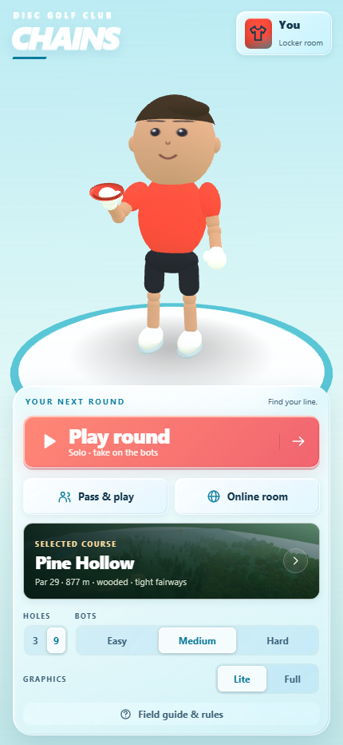

# Chains — mobile 3D disc golf

**[Play on desktop or mobile](https://chains-disc-golf.vercel.app)** · Online and pass & play support up to **12 players**.

**Playtesting with friends?** Start with [docs/PLAYTEST.md](docs/PLAYTEST.md): the three ways to play together, controls, and what to report.

Swipe-to-throw disc golf in the browser. Aim by dragging the view, pick a disc and a throw type, then swipe in the throw pad: the swipe direction must match the throw (backhand →, forehand ←, tomahawk ↓, scoober ↖, hammer ↘, blade ↙, putt ↑; inside-out and outside-in variants of both backhand and forehand), the swipe length sets the power bar, and a slightly lower or higher swipe adds hyzer or anhyzer. Discs fly with a real turn/fade model, skip, roll, kick off trees, chain out, and splash into ponds.



## Play

- **Play round** — you vs two bots (easy / medium / hard).
- **Pass & play** — up to twelve people on one phone, plus optional bots.
- **Invite match** (clubhouse → Friends) — the GamePigeon way: start a match, send the link to your group chat, and everyone plays their hole when it suits them. One turn is a player's whole hole; up to twelve players. Whoever has played the fewest holes goes next (late joiners catch up first), then honours. The next player gets a push notification ("Your turn in Chains"), and the one-tap **Tell them it's their turn** button opens the share sheet for Messages. Works on any network (plain HTTPS to `api/match.js`; matches live in a private Vercel Blob store). iPhone sends web alerts only to games added to the Home Screen; the match screen walks through it and carries your seat into the installed app. A player who sits on a turn for 30 minutes can be skipped and comes back by tapping *I'm back*.
- **Live room** (Friends → Live room) — one player creates a room and shares an invite link or a four-character code; friends join from their own devices. Up to twelve players over [PeerJS](https://peerjs.com/). The host validates throw input, computes flight and distributes the same replay to everyone. Reconnects restore scores and the current shot. A disconnected player keeps their slot for 30 seconds, then a bot takes over; returning players can reclaim the slot. A guest whose network blocks a direct WebRTC connection (cellular carrier NAT, strict Wi-Fi, no TURN configured) joins through an encrypted public MQTT relay instead (`src/relay.js`: AES-GCM keyed by the room code, the topic a hash of it). Keep the host’s browser open: closing it ends the room.

Four courses, three or nine holes each:

- **Pine Hollow** — wooded, tight fairways, doglegs, water on 3, 6 and 9.
- **Cedar Meadows** — open rolling meadow at golden hour, long holes, strong wind.
- **Lakeshore Links** — morning light, water in play on five holes.
- **Gull Point Bluffs** — exposed coastal headland: the windiest course by far. Windsocks on every tee, drifting wind streaks and leaning grass show what the flight model is fighting.

**Locker room** — a Blender-authored athlete (`tools/build-golfer-v2.py`) with Face / Hair / Outfit / Body tabs. Face: eyes, eye colour, brows, nose, mouth, facial hair and glasses are atlas decals on the head. Hair: twelve styles, seven kinds of headwear, colours for both. Outfit: shirt colour and style (hoops, stripes, sash, sleeves, split, chevron), trim, number, shorts, socks, shoes, wristbands. Body: skin, build, height and throwing hand (left-handers get mirrored clips and physics). Each player's appearance travels with them in online rooms.

Works on phones (touch) and desktop (mouse or keyboard). On a phone, two thumbs: one drags the aim while the other swipes (on its side the screen splits, aim on the left and swipe on the right), and full power is one thumb stroke from wherever it starts. A first-turn tutorial walks through it with ghost thumbs (aim, throw, then both at once); replay it from the field guide. Hold Space for power and release to throw, arrows / WASD aim, Escape cancels, 1–4 select discs, Q / E cycle throws, T targets the basket and O opens overview. Add it to your home screen for a full-screen app.

### Look

Stylised shapes, physically based surfaces. The ground is a photographic grass tile washed 58% toward white so it supplies blade grain while each course's palette lives in vertex colours (mow stripes, first-cut collar, putting green, worn soil); a blade-scale normal map repeats eight times finer than the tile, and dirt and sand blend in by splat weight. Trunks carry a bark photo, tee pads concrete, water a scrolling normal map. One warm sun casts filtered shadows from trees, players and baskets; the sky is prefiltered into image-based ambient so discs, chains and shoes reflect it. Full adds the course HDRI, bloom and a broadcast grade (lift, saturation, grain, corner vignette); Lite keeps every texture and shadow without render targets. ACES tone mapping on both.

### Athlete

Two photoreal Meshy bodies, rebuilt for Chains in Blender (`tools/build-golfer-v3.py`): the male from the ultimate frisbee project's scan and a female generated from a matching studio concept through Meshy 7 image-to-3D with its auto-rig. Each is decimated in two passes in the scan's own A-pose (face and hands keep 30 % of the budget) to a 12.4k Draco body plus a phone LOD, unwrapped afresh and baked from the untouched copy while the arms are still clear of the torso (albedo, tangent normals, occlusion, a world-position map and arm maps), then straightened into the ChainsRig rest with its fingers curled into a rim grip and its 24 auto-rig joints merged into the eleven Chains bones so all 32 authored clips drive either body. A neighbourhood-vote classifier turns those into regions (skin, shirt, shorts, hair, socks, shoes, iris, feathered beard zones) and the runtime material (`src/body-material.js`) recolours each region as palette x baked luminance / region mean, so every locker colour applies while the photographic pores and folds survive. Studio lighting is flattened on cloth so a colour lands evenly. Hair and headwear are caps grown from the measured skull (domes clear the hair shells; big styles hide under domes); "short" is the scan's own hair recoloured. Glasses are geometry: round and square rims on the eye line, or a tinted sport shield. The female shares the rig and clips; her hip drops are scaled by leg length. The flight preview is a screen-space dashed ribbon over a dark outline with a ground arrow at the lie, and wind is drawn as tapered streamlines.

### Course trees

Full tier instances Blender trees (`tools/build-trees.py`): tapered branch tubes with crossed photo leaf cards (keyed Higgsfield leaf and pine clusters in `assets/textures/foliage`), three deciduous and three pine variants plus two bushes, alpha-tested with cut-out shadows. Cards pack along every limb and fill the crown core so no trunk shows through the mass (about a hundred cards per deciduous crown, 1.9k triangles per species file). A hemispherical occlusion gradient is baked into the leaf vertex colour (lit top rim, dark core and underside) and each leaf normal points away from the crown centre (per tier on pines) rather than across its card, so the runtime lights a crown as one volume with a bright top and dark underside; trunks stay bare for a third to a half of the height so the branch skeleton and sky gaps read, and every instance gets its own tilt, height and a roughly ±10% hue and lightness lean; leaves lit from behind glow through a back-light term in the leaf shader. Lite keeps the embedded low-poly crowns.

### Game interface

The clubhouse, course picker, locker room and HUD share white/cyan frosted glass, coral actions, local SVG icons and tactile buttons. Course cards show the actual toon course. The live HUD uses a compact score strip and equipment pickers. Sound icons crossfade, flight controls disable during throws, and leaving a round uses an in-game confirmation. Online validation appears beside the room controls.

Styles live in `src/ui.css`, with no external fonts or UI framework. Keyboard focus and reduced-motion styles are included. See the [art-pass report and screenshots](docs/qa/r3/REPORT.md); all six viewport overlap audits pass after this update.

## Rules implemented

Standard stroke play, lightly simplified:

- Lowest total throws wins; scores shown relative to par (ace, eagle, birdie, par, bogey…).
- Tee order is by honors (best score on the previous hole). After the tee, the player farthest from the basket throws next.
- The next throw is played from where the disc came to rest (your lie).
- Holed when the disc comes to rest in the tray or is caught by the chains. Putts thrown too hard blow through or spit out ("chain out").
- Water and the course boundary are out of bounds: +1 penalty throw, play from where the disc last was in bounds.
- Circle 1 (10 m) is drawn around every basket. Pick-up at par + 5 keeps rounds moving.

## The flight model

`src/physics.js` is plain math with no rendering dependency, so the bots plan with it and it runs in a Node test.

- Lift and drag from angle of attack (a flattened, low-lift version of the classic Frisbee coefficients).
- Gyroscopic roll: above the disc's stable speed it **turns** (rolls toward anhyzer), below it **fades** (rolls toward hyzer). Spin direction flips for forehand, so backhands finish left and forehands finish right for a right-handed player.
- Discs have real flight numbers (speed | glide | turn | fade). Throw a putter at driver speed and it turns over; throw a driver too slowly and it dumps early.
- Ground skips, cut rollers, tree trunks (hard kicks) and foliage (random branch hits), and a basket with chains, band, tray and pole.
- Overhand throws start vertical and roll over in flight; the scoober starts inverted and flips back to flat.
- The hammer is released past vertical, flattens upside down at the apex and drops steeply.
- Wind is a real force (headwind lifts and turns the disc over, tailwind starves it, crosswind pushes). Landings depend on the surface: rough grass kills skips and rolls, and a tilted landing rocks like a dropped coin before it settles.

## Run it locally

Install the pinned dependencies, then start the development server:

```bash
npm ci
npm run dev
```

The underlying server command is:

```bash
node serve.mjs
```

then open http://localhost:8093. (Opening `index.html` from disk won't work because ES modules need http.)

Physics sanity test:

```bash
node test/physics.test.mjs
```

## Deploy

Production is a static, bundled Vercel build. Three.js, PeerJS, Draco and Basis codecs are served from the same origin, with no runtime CDN dependencies. Only runtime files go into `dist`; art projects, QA files, credentials and development tools are excluded.

```bash
npm run build
npm run preview
vercel link
vercel deploy --prod
```

Environment (Vercel project settings): `BLOB_READ_WRITE_TOKEN` (added when the private Blob store `chains-matches` is connected), `VAPID_PUBLIC_KEY` / `VAPID_PRIVATE_KEY` / `VAPID_SUBJECT` for turn alerts (`npx web-push generate-vapid-keys`). Optional relay for live rooms across networks (a phone on cellular often can't reach a peer on Wi-Fi directly): Cloudflare Realtime TURN keys as `CLOUDFLARE_TURN_KEY_ID` + `CLOUDFLARE_TURN_KEY_API_TOKEN`, or any TURN service as `TURN_URLS` (comma separated) + `TURN_USERNAME` + `TURN_CREDENTIAL`; `api/ice.js` hands them to the client. `npm run preview` runs the `api/` functions locally with file storage in `.data/`.

`vercel.json` sets the build, output directory and cache headers. Hashed JavaScript chunks use immutable caching; mutable assets revalidate. GitHub auto-deploy is optional; the published build uses the authenticated Vercel CLI.

## Structure

| File | What it does |
|---|---|
| `src/physics.js` | Flight model, collisions, basket catch, OB, headless simulation |
| `src/course.js` | Seeded terrain, fairways, instanced trees with colliders, ponds, tee pads, baskets, sky |
| `src/player.js`, `src/gltf-player.js` | Rigged GLB golfer, wardrobe, scrubbed Blender clips and procedural fallback |
| `src/models.js` | Optional GLB cache, Draco and KTX2 loaders |
| `src/materials.js`, `src/effects.js` | Toon terrain, foliage wind, clean water; retained optional legacy rendering infrastructure |
| `src/input.js` | Pointer gestures: aim drag and throw swipes |
| `src/bot.js` | Bots simulate candidate throws and pick the best, with difficulty noise |
| `src/net.js`, `src/protocol.js` | PeerJS host/guest live rooms (binary serialization, relay servers from `/api/ice`), message validation |
| `src/match.js`, `sw.js` | Invite matches on the client: seats on the device, match screens, share sheet, push subscription; the service worker shows turn alerts |
| `api/match.js`, `server/` | Invite-match API (Vercel Function): `match-core.js` rules and turn order, `store.js` Blob/file storage with ETag-checked writes, `push.js` Web Push |
| `src/audio.js` | Synthesized sound: modal metallic chain cascades, wood knocks, water, wind and birds, with a short outdoor reverb |
| `src/assets.js` | Optional asset manifest: drop generated textures, course art, disc stamps and real recordings into `assets/` |
| `src/main.js` | Game state machine, camera, hub menu, locker room, HUD wiring, online sync |

Development serves ES modules; production uses the build above. Optional art can fall back to procedural assets. The shipped art replaces procedural defaults; an empty `assets/` folder still boots and plays. Sounds retain synthesis and accept optional sample overrides. To upgrade the look and sound with generated or recorded assets, follow [docs/codex-asset-prompts.md](docs/codex-asset-prompts.md); anything you add to `assets/manifest.json` replaces the procedural version, everything else keeps working.


## Graphics and animation

- **Mobile** (was Lite): a 6.2k-triangle male athlete and 12.4k-triangle female athlete with compressed 1024/512 bakes and no normal map, embedded low-poly crowns, gradient sky, cartoon clouds and real shadows. The female preserves the Full body's UV atlas to keep wardrobe textures aligned. Full-only texture/decoder requests are skipped at startup; the procedural golfer remains as the fallback when no model loads.
- **Desktop** (was Full): the 12.4k Draco athletes with 2048 albedo and normal maps, 32 mesh-free animation files, photo-leaf trees, course HDRI ambient, bloom and grade.
- Eleven Blender throws, authored for both hands, use phase **0–0.5 for swipe windup**, **0.62 for release**, and **0.5–1 for follow-through**. Idle weight shifts, practice swings, walking and score reactions use separate clips.
- A basket-to-tee camera introduces each hole. Chain-hit slow motion changes playback speed only; physics and network trajectory data stay unchanged.
- Every throw draws a ribbon in the disc's colour over its last .8 s of flight, a fixed angular width so a drive reads at 80 m (`src/flight-trail.js`). Baskets have a gold powder-coated tray and galvanised chain links shaded per pixel. The putt's air is thin enough that the woods behind the pin stay green ([gauntlet against Disc Golf Masters](docs/qa/dgm-gauntlet/REPORT.md)).
- Graphics switching rebuilds and disposes course resources. Foliage uses spatial groups; resolution can scale down during sustained slow frames. Lite never exceeds its original pixel-ratio cap.

## Validation and budgets

Run the checks:

```bash
node test/physics.test.mjs
node test/assets.test.mjs
node test/animation.test.mjs
node test/feedback.test.mjs
node test/match.test.mjs
python test/sfx-normalization.py
```

Browser checks (real headless Chrome; set `CHROME` to its path): `node tools/verify-browser.mjs --dist` (live room: four rendered players plus nine extra peers over real WebRTC), `node tools/verify-matches.mjs` (invite match: two isolated phones play a whole 3-hole match through the UI and API), `node tools/verify-rounds.mjs` (bots play 3-hole rounds on every course). Each also takes `--url https://chains-disc-golf.vercel.app`; `verify-browser` adds `--public-signal` there. `node tools/verify-relay.mjs --dist` (`npm run test:relay`) (local only) plays a live room with a guest whose WebRTC cannot open, through the MQTT relay, while phones lock: a relay guest locked 10 s throws on return, the host locks 15 s while that guest throws, and a throw request held back 9 s hands the turn back and still counts once.

The asset test checks manifest files, GLB structure, Draco/KTX2 extensions, the golfer triangle budget, bone/material names and animation clips.

Round-three QA: **83 manifest entries**, all ten throws pass handedness and flight regressions, a real pointer swipe and a complete Full-quality hole pass, and empty-assets play works in both qualities. No JavaScript errors in integration checks. The six viewport overlap audit, including the open ten-entry throw sheet, includes 360×740, 430×932, 812×375, 568×320, 768×1024 and 1366×768. That historical transport result is superseded by the current protocol-v2 browser verification below.

The art pass brings Lite startup below **2 MB**, including CDN code (see the current byte ledger in [the canopy report](docs/qa/r4/REPORT.md)). Disc stamps are 6.6–18.7 KB; normal maps are 256px JPEGs. **60 fps Lite / 45 fps Full on mid-range Android and iPhone 12 remain physical-device targets, not certified results.** Desktop Chromium does not establish mobile GPU or Safari performance.

See [current canopy QA](docs/qa/r4/REPORT.md), [overlap and startup results](docs/qa/r4/after-browser-results.json), [round-three QA](docs/qa/r3/REPORT.md), and [decisions](docs/decisions.md). Round four closes the critic's cohesive-canopy defect in portrait and flyover views; its remaining named gap is ground lighting, outside that round. Lite transfers **731 KB**, within the same 2 MB startup budget. Before/after images live in `docs/qa/r4/`; 43.97 MB of historical captures were pruned previously and remain in Git history.

### Physical phone readings

Open the game with `?fps=1`, play **Pine Hollow hole one**, and read the overlay in each quality. These four results are pending user readings from the physical phones; desktop screenshots do not populate this table.

| Device | Lite FPS | Full FPS |
|---|---:|---:|
| Android | Pending | Pending |
| iPhone | Pending | Pending |

The [device record](docs/qa/r3/sound-device-detection.json) retains nulls until readings arrive. A result below **55 FPS Lite** or **40 FPS Full** triggers optimization of that phone's resolution scaling and foliage budget. The existing 60/45 FPS targets remain aspirational until measured.

## Rebuild art (optional authoring tools)

The web game needs none of these tools. Blender sources live in `art/blender/`; image prompts are in [the asset brief](docs/codex-asset-prompts.md).

```bash
blender --background --python tools/build-golfer-v3.py -- --preview docs/qa/r7                        # male: Meshy athlete -> ChainsRig body, LOD, masks (needs the frisbee project's athlete-v2.glb; --source <path>)
blender --background --python tools/build-golfer-v3.py -- --variant f --source art/meshy/athlete-f.glb   # female (the Meshy GLB is not in the repo)
python tools/pack-body-textures.py [--variant f]            # WebP albedo/normal + PNG masks per figure and tier, updates the manifest
blender --background --python tools/build-trees.py -- --preview docs/qa/r7                            # pine, deciduous and bush GLBs with leaf cards
blender --background --python tools/build-golfer-v2.py   # previous lofted athlete (kept for reference)
blender --background --python tools/build-disc.py        # lathed disc with mould text
blender --background --python tools/render-icon.py       # app icon: the game's basket and a disc in the chains (Cycles) -> art/icon/icon-render.png
node tools/pack-icons.mjs                                 # apple-touch, PWA and favicon sizes from that render (ffmpeg)
blender --background --python tools/build-headwear.py    # fitted hats grown on each athlete's skull and hair -> assets/models/headwear.glb ([--preview art/qa-headwear])
# Key art for the loading screen and link previews: art/keyart (ChatGPT wide, Gemini tall; prompts in art/keyart/prompts.json),
# scaled into assets/keyart/ with ffmpeg
python tools/split-golfer-clips.py
# Rebuild the current authored motion set after rebuilding the body:
node tools/extract-poses.mjs
blender --background --python tools/author-golfer-clips.py
blender --background --python tools/refine-athletes.py   # volume-preserving surface pass -> versioned premium bodies
blender --background --python tools/author-canopies.py
python tools/texture-pack.py
node tools/build-face-atlas.mjs
```

The current male body is **281 KB / 12,400 body triangles** (28k with every hidden hair, headwear and glasses variant, Draco) and its phone LOD **175 KB / 6,200**; the female is **345 KB / 12,369** and **319 KB / 12,369**. Body textures are about 1.1 MB per figure on Full and 300 KB on Lite; the three tree files total 53 KB plus 380 KB of leaf textures. Thirty-two independent animation GLBs contain no mesh, material or texture payload: eleven throws and five shared actions for each hand. Left-handed clips use positive scales, so jersey numbers stay readable. The eleven bone names remain unchanged. `tools/build-face-atlas.mjs` builds deterministic flat face parts and compresses them with Khronos `toktx`; the runtime retains its generated atlas fallback. Legacy model and Unity authoring tools remain in the repository.

Twelve original 256px painted JPEG detail tiles add 147.6 KB across all materials. The toon ramp and palette remain; skin and fabric follow the actor, while terrain blends fairway, rough, green and sand. See [texture provenance](art/textures/r3/prompts.json) and [motion authoring](docs/qa/r3/animation-authoring.md).

Six compact Blender crown variants use baked vertex occlusion and authored smooth normals: 528 triangles per pine and 576 per deciduous tree. The 49.3 KB embedded geometry retains instancing, wind deformation, 64 m groups and existing collision radii, and works with an empty asset manifest. Dense source meshes and the optimized shells are preserved in `art/blender/canopies-r4.blend`.

### Sound recordings — conditional generation skipped

`python tools/generate-sfx.py` uses the ElevenLabs sound-effects API to generate twelve effects, normalizes each to −6 dBFS, and publishes `manifest.sfx` only after the full set succeeds. It requires `ELEVENLABS_API_KEY` and ffmpeg. The credential was unavailable during this pass, so **no ElevenLabs recordings have been generated and `sfx` is still empty**. Synthesis supplies chains, applause, a descending miss reaction and reward notes until recordings are available. The normalization test uses a synthetic fixture, not a claimed generated recording.

`art/unity/Assets/Editor/RenderChains.cs` renders the sampled course layouts to JPEG cards and half-float EXR skies. Run Unity in batch mode with `-projectPath art/unity -executeMethod RenderChains.Run -quit`. Generated Unity scenes/caches are disposable; the editor script recreates them. There is no Unity game build or runtime dependency.

Publish the generated `dist/` directory for deployment. The local `chains.avatar` and `chains.course` preferences remain compatible. Rooms now use protocol v2: guests send bounded throw requests, and only the host sends trajectories, membership changes and next-hole commands. Older room clients must reload.

## Current playability pass

- Up to 12 online or local players; roster capacity and joins after a round starts are checked. Invite links fill the join code.
- Swipe capture includes movement outside the pad, final release coordinates and coalesced pointer samples. OS cancellation, secondary fingers, blur, rotation and hidden tabs cannot accidentally throw. A live trail and authored windup track your swipe.
- Keyboard charging, aiming, equipment shortcuts and cancellation work alongside mouse gestures.
- Hosts maintain authoritative game updates on a lightweight timer while hidden; hidden guests restore authoritative state on return. Browser/OS suspension can still interrupt a host, so keep its page open.
- Mobile starts in Lite, uses an appropriate pixel budget, and adapts resolution toward 60 fps. Sustained slow Full rendering drops the optional postprocessing pass. Shader warmup runs before the tee; bot planning yields within a 4 ms budget; distant spectators update at 15 Hz.
- Scoring uses the existing rigged celebration and score audio, with one pooled confetti draw at the player for successful holes. Reduced motion disables confetti and skips the flyover.

Run `npm test` for physics, assets, animations, feedback, touch/keyboard and protocol checks. `npm run test:browser` runs four rendered Chrome players plus additional real WebRTC guests, the 12-player capacity limit, ownership checks, identical shot results, reconnection and rotation. For the published game, use:

```bash
node tools/verify-browser.mjs --public-signal --url https://chains-disc-golf.vercel.app
```

See [the current report](docs/qa/playability/REPORT.md). Desktop Chrome emulation verifies layout and interaction, not actual iPhone/Android GPU performance; physical-phone fps remains unverified. The current visual polish does not establish a universal AAA-quality rating.

## Athlete realism and shot planning

All four production athletes now use a Blender surface refinement that preserves facial detail, UVs, clothing, rig weights and shoe soles. Subtle generated athletic-knit fabric and gentler skin normals replace the conspicuous printed grid. Modeled hands blend from the seated grip through release, with separate relaxed fingers on the free hand.

Idle, practice, walking, celebration and disappointment clips have new motion for both hands. Runtime recovery keeps the outgoing pose and blends smoothly into the next stance; bounded head tracking follows the basket or flying disc. Ground support samples the actual skinned shoes on the course slope. A short swipe completes its remaining windup before the authored release, instead of jumping directly to phase .5.

While aiming a throw from outside the circle, the full flight preview includes a terrain-following landing reticle, predicted travel and distance left, surface and water/OB warnings. A physics search suggests starting power and marks it on the gauge. Trees can change the real landing, so the guide labels its open-flight estimate. The guide plans a shot but never solves one: putts and anything inside 10 m get no reticle, readout or power mark, and once the swipe starts the ribbon returns to 70% of the flight and the estimate hides, so the release is the player's feel.

Sound: the mute button is remembered between visits, and `?mute=1` starts silent (for test browsers and the iOS Simulator) without saving.

See [screenshots, motion recordings, asset provenance and validation](docs/qa/premium/REPORT.md). Run `node tools/verify-premium.mjs` with the dev server running to check the guide at six viewport sizes and exercise a real touch release. The [athlete review viewer](http://localhost:8093/docs/qa/player-review.html) exposes both bodies, detail tiers, hands and every motion for inspection.
