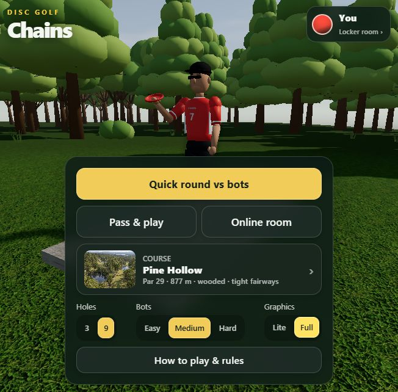
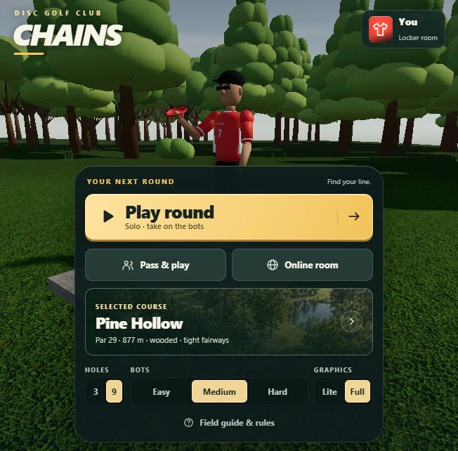

# UI refinement QA

September 14, 2026. Static ES modules; no build step or UI dependencies added.

## Before / after

Same 652×642 viewport and Full graphics:

| Before | After |
| --- | --- |
|  |  |

Additional captures: [430×932 portrait](07-portrait-final.jpg), [desktop](07-desktop-final.png), [course selection](07-courses.png), [locker room](07-locker.png), [HUD](07-hud.png), [568×320 HUD](07-hud-568x320.jpg), [leave-round dialog](07-leave-dialog.png).

## Surfaces, hierarchy and images

| Severity | Location | Before | After | Why |
| --- | --- | --- | --- | --- |
| MEDIUM, resolved | src/ui.css:12; index.html | Similar rectangular actions with accumulated glass overrides | Gold primary action, quieter alternatives, consistent borders/radii, a dedicated stylesheet | Shadows convey elevation; structure and hierarchy make the next action clear |
| MEDIUM, resolved | src/ui.css:75 | Small thumbnails beside course names | Panoramic cards with a text scrim and low-opacity white outline | Image outlines establish edges; selected cards retain a check and gold border |
| LOW, resolved | src/ui.js:117 | Plain name/score rows | Numbered standings and an SVG trophy for the winner | Clear ranking, aligned scores and tabular numerals |

## Icons, state and motion

| Severity | Location | Before | After | Why |
| --- | --- | --- | --- | --- |
| MEDIUM, resolved | src/icons.js; src/ui.css:101 | Mixed emoji controls and arrows | One local 2 px currentColor SVG set | Icon weight and optical consistency across equipment and navigation |
| MEDIUM, resolved | src/ui.js:60; src/ui.css:120 | Pointer-only disabled controls; sound replaced with emoji | Native disabled state, aria-pressed, accessible sound labels and 150 ms icon crossfade | State persists beyond animation and keyboard users cannot activate disabled controls |
| MEDIUM, resolved | src/ui.js:12; src/ui.js:18 | Browser pop-ups and connection labels that overwrite icons | Styled leave dialog, inline room errors, busy buttons preserving icons | Consistent surfaces and useful feedback while waiting |
| LOW, resolved | src/ui.css:12; src/ui.css:235 | Inconsistent interaction styling | 0.96 press scale; explicit transition properties; focus and reduced-motion states | Tactile, interruptible feedback without unnecessary motion |

## Verification

- `node test/physics.test.mjs`: pass, flight values unchanged.
- `node test/assets.test.mjs`: pass; all 39 manifest files and model constraints intact.
- Node syntax checks for changed JavaScript and `git diff --check`: pass.
- [Six viewport results](07-overlap-results.json): 360×740, 430×932, 812×375, 568×320, 768×1024 and 1366×768. No button overlap, off-screen control or clipped label. Includes scrolled panel bottoms and modal-only control bounds.
- Manual browser: clubhouse, course picker, locker room, throw selection, sound on/off, a real 66% swipe, bot turns, and controls re-enabled for human throw 2. Leave dialog Keep playing and Leave round both work; default focus is on Keep playing and returns to Menu after cancellation.
- [Connection UI diagnostics](07-state-results.json): blank code displays an inline error and focuses the code field; both busy buttons disable, retain their SVG, and restore the original label/state.
- Final Chromium diagnostics: zero console errors/warnings and zero failed resource responses; course images decode. The CSS and SVG module are loaded locally; no extra fonts or UI libraries.
- Code inspection covers hover, active, focus, selected, disabled, loading and reduced-motion rules. Existing procedural empty-assets fallback and online message formats were not changed.
- **Not verified in this pass:** 10%-speed replay in the browser Animations panel, physical Android/iPhone rendering, and a new live two-device online session. Prior network/fallback evidence remains in the milestone 6 report; it is not presented as newly repeated testing.

**Approve** for the inspected UI changes and responsive coverage. No HIGH findings remain in that scope.
