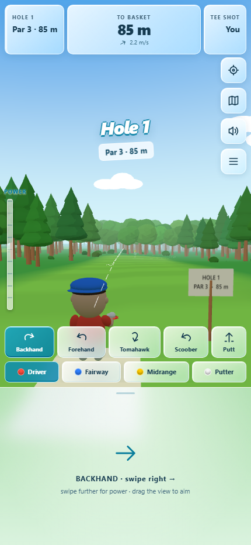
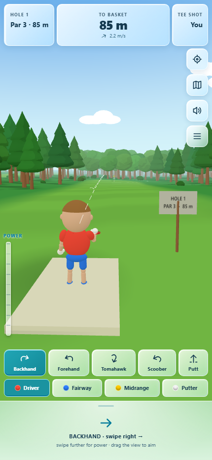
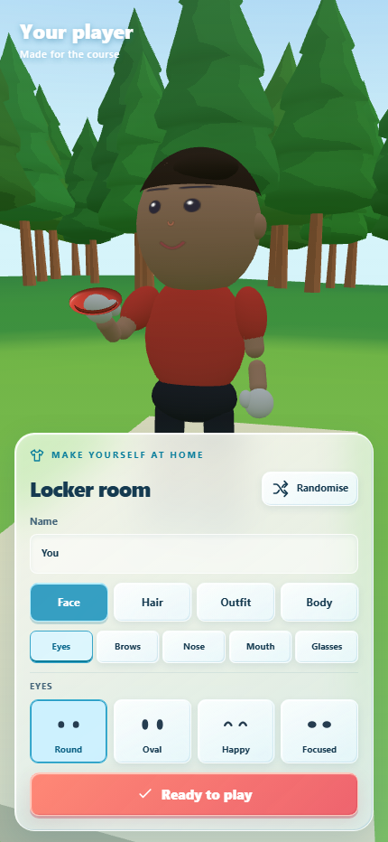
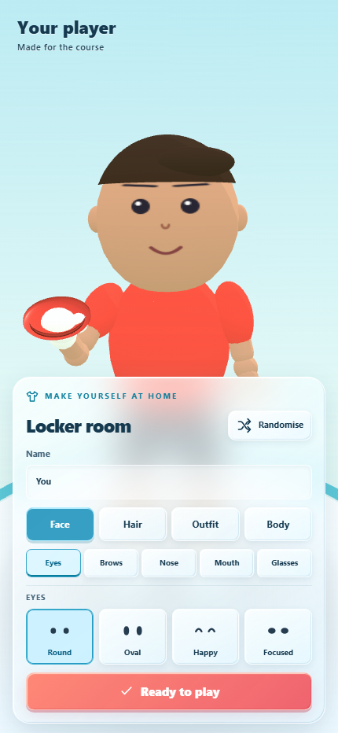

# Compact HUD response to round 2 critique

The critic identified the oversized gesture pad as a major competitor with the course. The portrait pad is now 120 CSS pixels tall, plus the device safe-area inset. At 430×932 this recovers 150 vertical pixels. Its arrow and instruction spacing fit the shorter surface; five throws and four discs stay immediately available with their existing touch targets. The portrait override also covers wide portrait tablets. Existing short-landscape positioning is retained.

The locker preview label is now navy, matching the parent's new pale studio backdrop.

## Evidence

| Before | After |
| --- | --- |
|  |  |
|  |  |

Ran the existing `capture-round2.mjs` harness with `QA_PREFIX=11-ui`, including `overlap-audit.js`, at 430×932. All nine audited UI states report no overlap, offscreen controls or clipped labels. Captures were visually inspected. The log contains four Chromium GPU readback stall warnings and no JavaScript errors. Full six-viewport validation remains the parent's integration check after camera changes.

Input code still derives power from the current gesture-pad rectangle (80% of its length); it does not depend on the former pixel height. No physics, storage or network code changed. Physical Android/iPhone frame rates remain owed. This revision does not claim a reference-comparison win.
