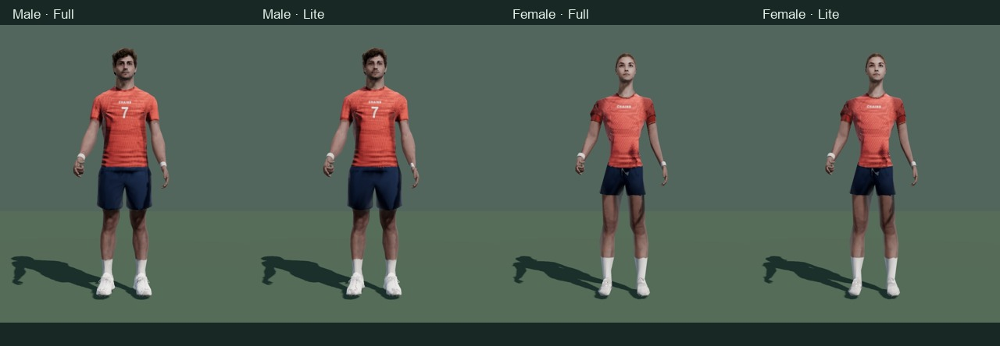

# Athlete realism and shot-planning pass

All four production athlete bodies have refined surfaces, subtler clothing detail and continuous modeled hands. The game now completes short-swipe windups smoothly, blends out of throws without a pose snap, follows the basket/disc with bounded head movement, and supports the actual skinned shoes on slopes. Idle, practice, walking, celebration and disappointment motions were reauthored for both hands.

The flight preview shows its complete path and landing point, travel distance, distance remaining and the predicted surface. Water and out-of-bounds estimates turn orange and label the remaining distance after the legal drop. A small physics search suggests starting power; it refreshes after aiming settles and marks the power gauge. The guide explicitly identifies its tree-free flight approximation.

**Follow-up review (Claude Code):** a live estimate during the swipe let a player drag until it read "Chains" and release, which solved putting. The guide now shows only while aiming, only outside 10 m and never for putts; during the swipe the ribbon stops at 70% of the flight with no reticle or readout. The interaction check asserts both rules. The same review removed a faint outline round the shirt print (a mipmapped fetch inside a branch) that the quieter knit had exposed.

## Play and inspect

- [Local game](http://localhost:8093/)
- [Interactive athlete viewer](http://localhost:8093/docs/qa/player-review.html): both bodies, Full/Lite, throwing hand, every motion, play/pause and orbit.
- [Desktop clubhouse](../premium-final-wide/menu.jpeg), [tee](../premium-final-wide/tee.jpeg), [putt](../premium-final-wide/putt.jpeg).
- [Phone clubhouse](../premium-final-phone/menu.jpeg), [tee](../premium-final-phone/tee.jpeg), [putt](../premium-final-phone/putt.jpeg).
- [Recorded drive](../premium-motion-final/drive.mp4) and [recorded putt](../premium-motion-final/putt.mp4). These are captured gameplay, including the real physics and cameras.
- [Drive contact sheet](../premium-motion-final/drive-sheet.jpg), [putt contact sheet](../premium-motion-final/putt-sheet.jpg), [complete athlete/wardrobe board](../premium-players-final/review-board.jpg).

## Authored assets

Blender 5.2.2 authored the surface pass and the 32 independent right/left motion files. Surface fairing preserves volume, rig weights, topology and UVs; movement is capped at 4 mm. Facial detail, fingers and shoe contact surfaces are protected. The female Lite mesh uses the Full UV layout, matching its shared texture atlas.

| Body | Body triangles | Runtime GLB bytes |
|---|---:|---:|
| Male Full | 12,400 | 280,876 |
| Male Lite | 6,200 | 174,612 |
| Female Full | 12,369 | 344,796 |
| Female Lite | 12,369 | 318,768 |

Triangle counts describe the body mesh. Embedded wardrobe variants add hidden geometry. [Blender build measurements](../../../art/blender/athlete-premium-report.json) retain exact displacement and export sizes.

Editable sources: [male Full](../../../art/blender/golfer-premium.blend), [male Lite](../../../art/blender/golfer-lod-premium.blend), [female Full](../../../art/blender/golfer-f-premium.blend), [female Lite](../../../art/blender/golfer-f-lod-premium.blend), and [motion authoring](../../../art/blender/golfer-motion-r6.blend). The original body source files remain available. Rebuild with `node tools/extract-poses.mjs`, Blender `tools/author-golfer-clips.py`, and Blender `tools/refine-athletes.py`.

The new [athletic-knit texture](../../../assets/textures/athletic-knit-premium.jpg) was generated using the **built-in image_gen mode**, then encoded as a 512×512 JPEG (97,703 bytes) for the game. [The full prompt and provenance](../../../art/textures/premium/prompt.json) are saved with the project. The generated source PNG remains under the recorded Codex generated-image path.

## Validation

- Production build succeeds; **8 test files pass**, including all eleven throws, both hands, the exact .62 release contract, recovery continuity, terrain support, power planning and water/drop-lie guidance. [Test log](../premium-unit-tests.log).
- **744 rendered pose cases and 28 wardrobe cases pass** across both bodies, detail tiers and hands. Every sampled skin is finite with no stretched edges; there are no browser/shader errors. [Results](../premium-players-final/results.json).
- **83 UI states across six viewports pass** with zero actionable overlaps, clipped labels or offscreen controls. The layout harness now follows the current Friends → Live room navigation and excludes collapsed details content. [Layout results](../premium-layout-final/layout-results.json).
- Real touch charging, OS cancellation, a short-swipe release and completed scoring pass. The first release frame remains near the swipe's phase instead of jumping to .5; subsequent frames complete the pull and launch at .62. The shot guide clears existing HUD plates at 360×740, 430×932, 812×375, 568×320, 768×1024 and 1366×768. [Interaction results](../premium-interaction/results.json).
- Four rendered clients and additional real WebRTC peers pass the 12-player room check, host validation, identical throws/lie/scoring, reconnection, hidden-host play, rotation and next-hole progression. [Online results](../premium-online/browser-results.json).
- **All four courses complete three-hole rounds** with three rendered players: Pine Hollow, Cedar Meadows, Lakeshore Links and Gull Point Bluffs. Every player has a valid score on every hole, with zero browser errors. [Round results](round-results.json), [run log](round-results.log).
- Final deterministic recordings show a backhand drive landing and skipping, and a 6.5 m putt hitting chains, with **zero browser/shader/encoding errors**. [Motion results](../premium-motion-final/motion.json).

## Practical scope

This pass upgrades the existing playable browser game and its editable Blender assets. The eleven-joint rig and authored throw families remain; facial bone animation and motion-capture retargeting were not introduced. Headless Chrome verifies rendering and interaction on this Mac. Physical-phone FPS and Safari performance still require device measurements. The visual upgrade is a step toward the requested AAA direction, rather than a claim of AAA production certification.
